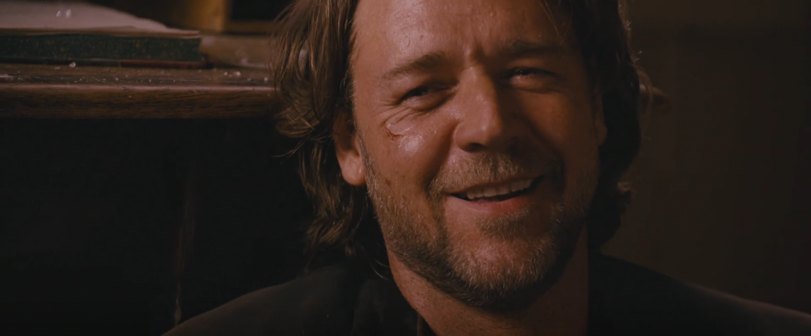
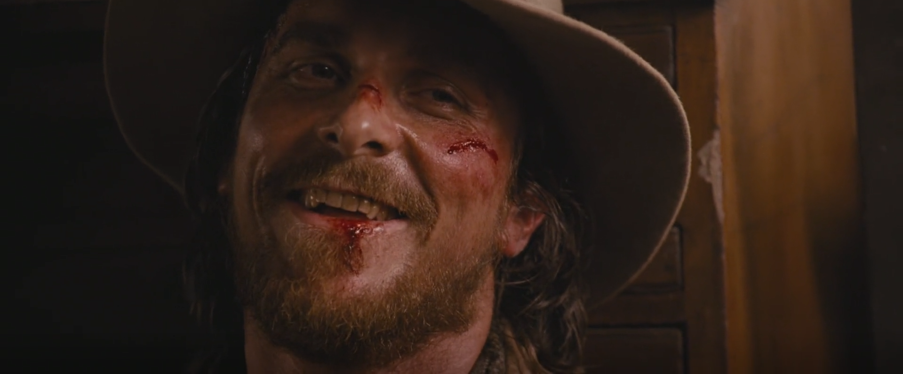
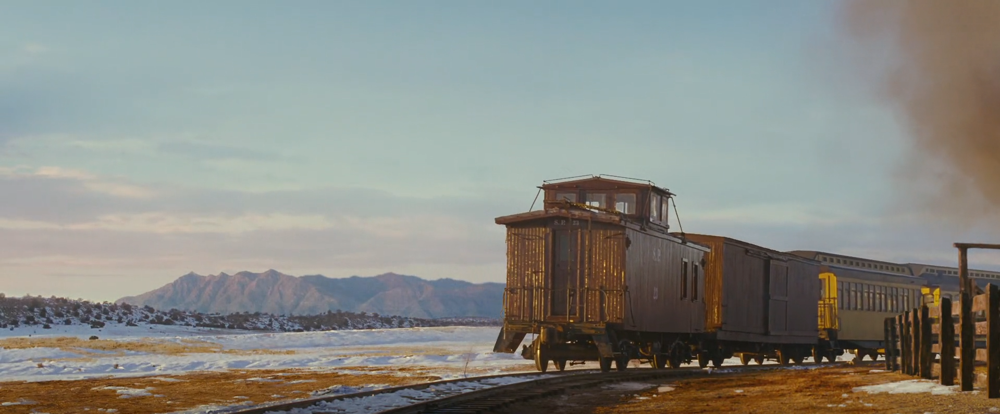

One evening in 2023, I was browsing [TV Tropes](https://tvtropes.org/) to find something to watch. I read an article about [3:10 to Yuma](https://tvtropes.org/pmwiki/pmwiki.php/Film/ThreeTenToYuma2007) and thought "yeah, sounds interesting. But I'm not into westerns". Oh, if only I knew...

One year later I've finally decided to give it a chance.

*And I absolutely loved it.*

Goddamn, did the actors deliver. The cinematography is great. The music is great. The script is great.

Many people think that the movie doesn't make sense, plot holes are everywhere, and the ending it terrible. But I personally can rewatch it forever. It just never gets boring. *But how?*

Not every movie is rewatchable. How can we define "rewatchable"?

*(The spoiler part begins here. If you haven't watched the movie, I higly recommend to. If you have, here's the [script PDF](http://www.cinefile.biz/script/yuma2010.pdf))*

## Dialogues

The actual plot starts at the moment when Ben is getting handcuffed. All that was before is just a setup, and to be honest, not the most entrertaining one. I'm ready to forgive it because the remaining is so great.

The moment the handcuffs are introduced, every scene moves the plot forward. The plot here is Ben and Dan opposition. Every scene one of them discovers something new about the other, and we too as viewers discover that.

Every interaction has a mini-twist, and the dialogues follow what I believe is the Golden Dialogue Rule: characters don't say what they know, they say *conclusions* of what they know.

If somebody stole your favorite pie from a fridge, you wouldn't say "Oh, who could have done it?" You would probably try to find out who did that and then go to them and say "How did you like my pie, you moron?"

There is no need to explicitly show that you're sad about your pie being stolen. It's obvious enough when you ask, so the viewers could guess that you were, in fact, sad about the pie since you decided to find the person who took it.

Sometimes, of course, you have to make characters say some important information for the viewers. But the best approach is when you have the viewers reverse engineering characters' minds.

*Conclusions of thoughts, not the thoughts.*

Let's look at an example from the script. This scene happens just after men agreed to escort Ben to the train. They're at Dan's house, Doc and Tucker are looking at a barn that was destroyed by Tucker himself the night before.

> Doc Potter keeps watch on Dan’s porch with Tucker. Both men cradling RIFLES in their laps. Doc Potter stares at the smouldering wreck of the old barn.
> 
> DOC POTTER:
> You have something to do with that?
> (off Tucker’s smirk)
> Hope you’re proud of yourself.
> 
> TUCKER:
> ...Doing my job, Doc.

See how nobody said "Burning down barns is bad"? Doc guesses it was Tucker's doing and says "Hope you’re proud of yourself". It's obvious that he does believe burning down barns is a bad thing, but that would be a way too simple thought which real people don't really have. People draw conclusions and build a chain of reasons.

You have something to do with that? *He does for sure. Why did he do it? Oh, guys like this think it's no big deal. But it's terrible, the barn is destroyed. And he probably thinks it was fun.* Hope you’re proud of yourself.

It's the classic 2+2 principle: don't say 4, say 2 and 2 and let the audience guess it's 4 themselves. Not only it makes a story more interesting to watch, it also makes characters more realistic and believable.

And this was just a little detail in the script. The scriptwriter tried to make every dialogue go through conclusions, not the actual knowledge — so every new line adds more depth to a character.

## Interactions

Every interaction between Bed and Dan shows something we hadn't known before. Here's the list:

### The Dinner

Ben doesn't look like a villain or a killer. He turns out to be really polite, but he sees the situation as a game. He is the only person having fun here. He confronts Dan's family by arguing with Dan about killing; smirks saying "Amen". But Dan is patient, he ignores every Ben's attempt to irritate him.
    
> DAN:
> Shooting animals is a lot different to shooting a man, son.
> 
> WADE:
> No, it isn’t. Not in my opinion.

### The Camp

Ben insults Dan with an implication that he doesn't deserve his wife. The first success in breaking Dan's mind armor. Dan wants to punch Ben, but stops. Dan's anger is exactly what Ben wanted to see. Dan is not immune to Ben's provocations.
    
> WADE:
> ...yeah, I’ll bet Alice was a real pretty girl before she married you.
> 
> ...and Dan just explodes, his RIFLE in Wade’s face.
> 
> DAN:
> Shut up about my wife. You say one more word about her and I’ll cut you down right here. Right here.
> 
> WADE:
> I like this side of you, Dan.

The same night Ben kills Tucker with a fork he's stolen from Dan's home. He has killed two people at the very beginning, but with a gun, there was a distance — this time it's a fork. It's close, it's personal, it's difficult; Ben's face is covered with blood. He doesn't avoid the violence of the moment, he even laughs shortly after and sings Tucker's last song.
    
The only Tucker's crime against Ben was disrespect. Ben's politeness doesn't stop him from being cruel; he would break free anytime if he wanted. But he doesn't for some reason.
    
It's the first time we change our opinion on Ben. Now he looks like a psycho murderer.
    
### The Rocky Road

Another conversation between Dan and Ben about killing.
    
> WADE:
> Something on your mind, Dan.
> 
> DAN:
> Why’d you kill Tucker.
> ...Why not me. Or Butterfield.
> 
> WADE:
> Tucker took my horse.
> ...Did you like him, Dan?
> 
> DAN:
> No. He was an asshole. But wishing him dead and killing him are two different things.
	
Dan confirms his view again. He denies violence despite being a veteran. The fact that Dan thinks killing Tucker was wrong *and also admits he was an asshole* makes Ben respect the man more.
    
Then Ben kills McElroy after taking an insult. Again, we see that Ben could kill them all if he wanted, but every time he only kills people who disrespect him. The murder last night wasn't luck, Ben is in fact dangerous. He easily gets a rifle, but Dan's son stops him here.
    
It's the first time we see Ben could go from a friendly conversation to literally throwing someone off a cliff in *seconds*. It's not that he couldn't control himself — he just decides to kill. He's smart and cunning. He can get use of any situation whenever he wants.
    
### The Apache Land

Ben saves the group from the apaches, but it's different. It looks like Ben helps others by killing the attackers, because, well, he's already a killer and nothing changes in him if he kills a few more people. He uses his corruption to... help? Of course, he saves himself in the first place, saving others along the way, but he did save Dan from the first shot.
    
The script differs from the movie version. In the script, Dan refuses to give Ben any bullets even when their lives (and his son's) are in danger, and Dan himself is wounded. The movie changes it: Ben just grabs a gun and it's already loaded; bleeding Dan couldn't really stop Ben from committing violence.
    
The cuff key moment is the same in both versions.
    
> WADE:
> Give me the key.
> 
> Dan digs the HAND-CUFFS KEY out of his pocket...
>
> ...then hurls it out into the field of tall grass.

Ben knocks Dan out and leaves. There is no chance he could deserve freedom in Dan's eyes.
    
It's the first time Ben decides to leave them.
    
### The Mountains
	
Ben gets caught by an enemy he doesn't even seem to recognize. Dan and the others save him. Dan says it's because of the money, but we suspect he believes that having Ben in prison is a right thing unlike letting some criminals torture him to death. That's not justice.
    
> DAN:
> At least, let us have our horses.
> 
> BOLES:
> I’ve got no problem with that. So long as you ride away.
> (pause)
> Ride away, rancher.
> 
> WADE:
> Nice knowing you, Dan.
    
Ben and Dan work together to escape, and they get along pretty well.
    
### The Hotel
	
All this time Dan has been saying that the only reason he is here is money. And Ben offers him way more money. Finally, Dan admits that he's been doing this because he believes it's the right thing. It was a final Ben's test, and Dan has passed it not realizing it. He wouldn't bother anyway.
    
We also see the reason why Ben is the way he is, why he quotes the Bible, and he is not even a Christian. He knows the Bible by heart because of the most traumatizing moment of his life — his father has died, and mother has left him. Makes you wonder what kind of a person he would have been if he could have better circumstances growing up.
    
It's the first time we learn he hasn't chosen this life. Does he want to change it? He sounded serious when he was talking about Mexico.
    
> WADE:
> What should I tell them?
> 
> DAN:
> Tell them you’ll write them a letter every day from Yuma.
    
### The Station

If you didn't know the context, Ben and Dan would look like a team running away from common enemies. But the context is Dan's leading Ben while Ben's gang's following them. The music is absolutely great — it's sad and hopeful at the same time.
    
> The two men finally catching their breath together now.
> 
> DAN:
> Worked alright, didn’t it.
> 
> WADE:
> Yeah... Worked real good.

And here it is, the ending that some people love and others hate. I like it. Many people say "How did a bag guy become good?" but the thing is, *he hasn't.* He probably thought there are no worthy people, that nobody really believes in anything they say. Dan made Ben realize decent people do exist, and one has died because of him. And since Ben doesn't care about unworthy people at all, he betrays his gang and kills them. He has never had any respect for them, but he's respected Dan, probably the only person he's ever respected since his childhood. Ben takes the 3:10 just because he doesn't risk anything — he will escape it the third time just like he's escaped before. But taking the train means the mission is done, and Dan's family will get the money.
    
That's my version. I think Ben was made likeable deliberatly — it would be easier for Dan to hate an unlikeable criminal.

## Admiration

There are also hints that Will — Dan's son — is similar to Ben. Will lost his father at a young age just like Ben; loud shooting in the air to make cows move; the repeated "What do you want me/him to say?" line; Dan and Ben even argue because of Will's admiration for Ben.

It doesn't lead to anything, just small hints to a possible Will's future to make him a deeper character.

## Rewatchability

Ok, now it's time to talk about the *rewatchability*.

The secret is we learn something new every scene Dan and Ben interact with each other. Every time I show the movie to my friends, I can see how their view of Ben changes from "polite criminal" to "unhinged murderer" to "cold psychopath" to "useful skilled psychopath" to "deeply troubled man". Dan's view changes the same way. And Ben's view of Dan changes too. At first, he thinks Dan is another hypocrite who says nice words but doesn't follow them. At the end, they talk to each other like friends but never forget they are not. They look like they might have been actual friends if their lives had turned out differently. It's not impossible to imagine Dan could be the criminal and Ben could be the rancher.

Every scene with them shifts their dynamic a bit, that's why it never gets boring. Every scene adds more depth to the characters. If we know something, it won't be repeated. Every time Ben kills someone, he does it differently, and we see how unpredictable but pragmatic he is. Every time Dan faces a new moral dilemma and chooses to keep going, we see how dedicated he is. A good writer *should* make the difficulty of characters' journey growing. That's why this story is great.

I like the psycological aspect of the movie. There are no great plot twists — just characters' gradual development as Dan chooses to keep pursuing his goal on every moral dilemma, while Ben challenges Dan's beliefs and grows to respect him. They never fail because of empathy — quite the opposite, they *always* remember who they are and what they want to achieve. They wish circumstances were different.

An impossible friendship that never happens.

